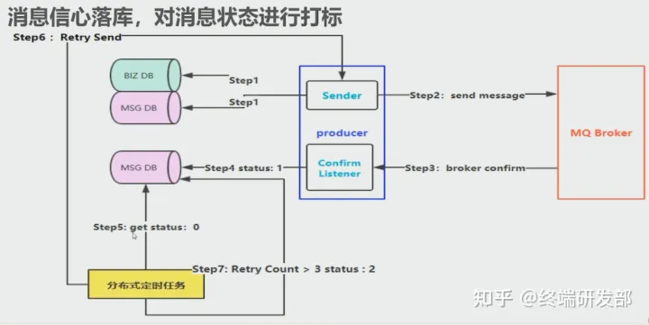

# RabbitMQ到底是怎么保证消息可靠性投递和消费的
保证消息的可靠性投递和消费，将分为两部分来进行，
第一部分来描述消息的可靠性投递，包含目前流行的两种可靠性投递架构，
第二部分将描述消息的可靠性消费，包含消息幂等性介绍等。
第三部分将结合RabbitMQ来讲述下怎么保证消息不丢失。
通过本篇的学习，可以学习到消息可靠性的投递、消费以及怎样保证消息不丢失。

消息可靠性投递
执行步骤：

保障消息成功发出
保证MQ节点成功接收
发送端收到消费端的确认应答
完善的消息补偿机制
解决方案：

业务和消息同时入库，对消息进行处理修改标记
消息延迟投递，做二次确认，回调检查
可靠性投递方案一：消息入库，对消息打标
1. 流程图如下

image.png

2. 流程拆解

①：消息和业务记录入库

②：第一步正常执行完后，将消息发送个MQ

③：消息处理完，发送确认消息给MQ

④：更新消息的状态

⑤：定时任务读取消息的状态

⑥：如果消息处理工程，流程结束，否则读消息重发MQ

⑦：重试次数内，重复执行流程；超过重试次数，将数据库更新状态

⑧：补偿系统，解决超过重试次数消息，保障消息的100%投递

3. 方案问题

两次数据入库，不适合在高并发场景使用。

可靠性投递方案二：消息延迟发送，做二次检查，回调检查
1. 流程图如下

2. 流程拆解

①：业务记录入库，业务记录正常入库后向MQ发送消息
②：第二次消息延迟3-5分钟，向MQ发送消息

③：消费监听队列，消费消息

④：消费者消费完后，发送确认消息给MQ的一个队列

⑤：另外一个服务监听消费者发送的confirm消息，如果正常完成，消息入库。

⑥：另外服务，经停延迟发送的队列，那消息检查msg数据库，如果没有，将再msg上新插入一条消息，用来记录重试次数

⑦：延迟检查成功，不需要任何操作；如果检查不成功，将通知服务，重新发消息给MQ

⑧：补偿系统，解决超过重试次数消息，保障消息的100%投递

消息可靠性消费-不重复消费
消息保证不重复消费，就要保证消息的幂等性，什么是幂等性？

幂等性：指消息执行一次和执行多次的结果相同，就说明消息是幂等的。

保证消息幂等性：

通过数据库主键形式(ID+指纹码)
使用Redis原子性保证幂等性
保证幂等性方案一：通过数据库主键形式(ID+指纹码)
指纹码：是唯一的系统码，可以是内部规则(如时间戳)和外部返回(如银行流水号)，通过指纹码和全局唯一ID做主键，利用数据库主键进行去重。

使用指纹码避免用户在一个唯一主键可能因为网络延迟等问题，对数据库进行多次写操作。

1. 实现

select * from table where id=唯一id+指纹码

实现简单，但在高并发情况下存在数据库写入性能的瓶颈。多余指纹码加大主键长度影响存储。

2. 解决方案

数据库采用分库分表，将id根据规则分布到不同的数据库表中，单一数据库分流降压。

保证幂等性方案二：利用Redis原子性操作保证幂等性
1. 实现

这种性能高，Redis是基于内存，不会造成数据库瓶颈。

2. 问题

①Redis数据库是否需要入库，怎样保证数据库和Redis中数据一致性(一般保证幂等是不需入库)

②如果不入库，怎样保证定时清理策略，缓存得可靠性保证(高可用-集群，定期清理策略)

RabbitMQ保障消息的可靠性传输
可靠性传输就是保证不丢失数据，丢失数据一般分为两部分，分别是MQ丢失数据，另外是我们生产消费消息时丢失数据。具体细分的包含生产者保证消息不丢失，MQ保证消息不丢失和消费者保证消息不丢失。

消息可靠性传递一：生产者保证消息不丢失
生产者保证数据不丢失可以采取两种方式：

使用RabbitMQ事务，在发送消息之前开启事务(channel.txSelect)，正常发送后提交事务(channel.txCommit)，如果出现异常，需要回滚事务(channel.txRollback)做消息重发等操作
缺点：RabbitMQ事务采用同步的方式进行事务处理，提交一个事务后，事务阻塞在哪，只有等这个事务执行完才能执行下一个事务，严重影响RabbitMQ性能，在 实际生产中不使用。

使用confirm模式，生产者开始confirm模式后，每次写数据会分配唯一id，当消息成功处理，将回传ack，消息处理失败，回传nack。
优点：采用异步模式，消费者发送一条消息后，不用等消息回传消息，就可以发送下一条消息，RabbitMQ将异步接受这条回传信息，如果是nack，将进行消息重试。实际生产中使用这种方式。

类型：普通Confirm模式 批量Confirm模式 异步Confirm模式，将再以后的博客中详细介绍3中不同的confirm类型

消息可靠性传递二：RabbitMQ保证消息不丢失
保证RabbitMQ消息不丢失，需要两步操作；

创建queue时，将queue设置为持久化，
发送消息的时，设置消息的deliveryMode=2。
即使这样操作，还可能存在，消息写到RabbitMQ中，但是消息没有持久化磁盘，这是服务器重启，这部分数据丢失。

消息可靠性传递三：消费者保证消息不丢失
消费端关闭自动应答，设置手动应答。

autoAck=false; 这样保证消费者消费消息后，删除RabbitMQ中数据。

小结
两种可靠性投递，第一种执行简单，但是不适合高并发环境；第二种执行复杂，但是减少一次数据入库，性能会有提高，适合高并发环境。如果MQ所在的服务器宕机，MQ中没有及时消费的数据会丢失
保证幂等性可以采用两种方式，第一种是主键方式，第二种采用Redis原子性，根据业务场景的不同来选择。
详细讲解RabbitMQ的消息可靠性传递，并从生产者，消费者和RabbitMQ来保证消息不丢失。

作者：i孤独行者
链接：https://www.cnblogs.com/dc-earl/articles/11176603.html
来源：csdn