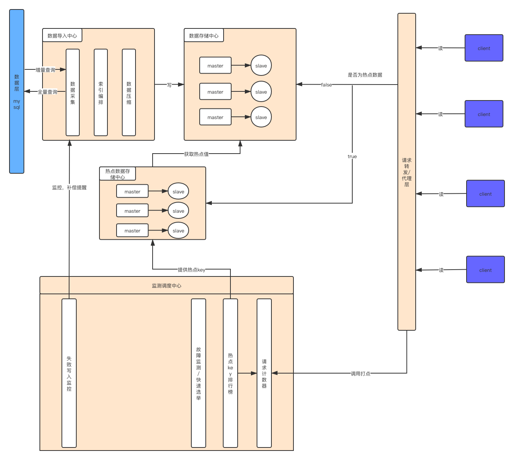
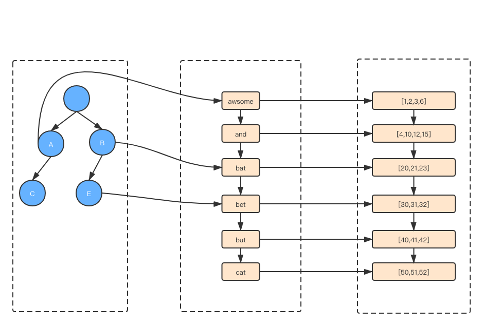

#缓存系统初设

----------------------------
## 01 数据导入中心
**系统边界：数据从持久化存储中获取，索引的建立，数据压缩**
### 1.数据采集
主动拉取   
被动监听
### 2.索引编排
主键索引（itemId）  
普通索引（配置）
### 3.数据压缩
压缩算法
## 02 数据存储中心
**系统边界：数据的分布式存储**
根据索引类型确定不同的数据存储类型  
主键索引：redis的hash式  
普通索引：trie树+倒排索引

## 03 热点数据存储中心
**系统边界：热点数据的存储**  
仅支持主键索引 hash式

## 04 监控调度中心
**系统边界：存储中心健康度检测，已down机器的重新选举，热点排行榜的维护，请求计数器，数据导入中心失败导入重请求**
### 1.请求计数器
kafka+redis
### 2.热点排行榜
定时任务，对请求计数器进行top1000排行，发送消息通知数据导入中心对热点数据存储中心进行数据导入
### 3.存储故障检测/快速选举
集群监听，故障节点重新拉起，选取新节点
### 4.失败写入监控
写入监听，通知重试
### 5.log记录
写入日志与读取日志记录
## 05 cacheProxy
**系统边界：请求数据的转发层。结果归并**
### 1.请求路由

### 2.结果归并
类似pipeline

###TODO:事务型命令

