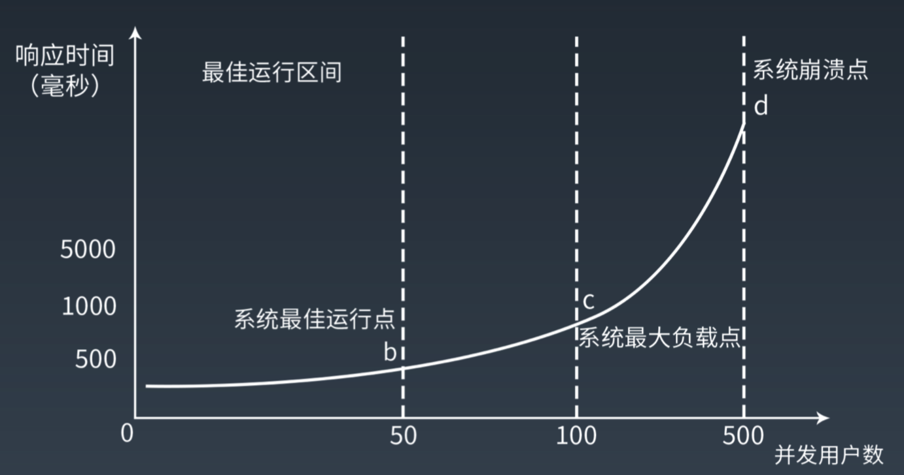
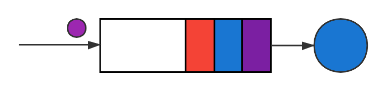

# 计算机系统性能分析
* 计算机系统性能分析
    * 什么是性能？
    * 压力，资源利用率，延迟
    * 排队网络
      * 单设备排队
      * 排队网络模型
    * 容量规划
    * 同步与异步
    * 线程模型，线程池
------

##什么是性能
工作中大家总是提到"高性能"。但是"性能"是什么？如何定义？
###推导性能定义
有人说：“性能是系统的响应时间。”

对，但不完全对。

我们可以通过常见的性能指标去推导性能的完整定义。

1. 性能是系统的响应时间(RT) + QPS == 性能是指定压力下系统的响应时间

2. 性能是系统的响应时间(RT) + QPS + SLA == 性能是指定压力下系统的响应时间的分布趋势

3. 放大2的结论得 性能是不同压力下所对应的响应时间的分布趋势

4. 可由3得出，性能是系统压力（QPS）与响应时间（Latency）分布（SLA）的对应关系。

###压力与响应时间对应关系

通过公式我们便可推算出不同压力下相对准确的响应时间！

###响应时间产生的原因
众所周知，计算机系统的cpu是根据时间片轮转分时占用，系统会将所有已就绪进程按照先入先出原则排成队列，当进程时间片耗尽，会继续
等待。所以我们可以继续将响应时间分解成<big>资源占用</big>和<big>排队</big>两部分。

在同一接口中，由于不会存在不同进程的优先级，则可等效通过Little's law（利特尔法则）对接口耗时进行计算，即在一个稳定的系统中，长期的平均顾客人数（L），等于长期的有效抵达率（λ），乘以顾客在这个系统中平均的等待时间（W）；或用公式表示为：L=λWL=λW。类比于计算机为压力，资源利用率与耗时的关系。

μ=\frac 1 {\Epsilon[S]}

资源利用率=\frac {设备忙碌时间} {总时间}=\frac {单位时间内平均处理的请求数} {单位时间内平均到达的请求数}=\frac λ μ=λ*E[S]
=\frac 1 {\Epsilon[S]}

ρ=λ*E[S]  
E[T]=f(λ,μ)=f(λ,S)=f(ρ,S)

