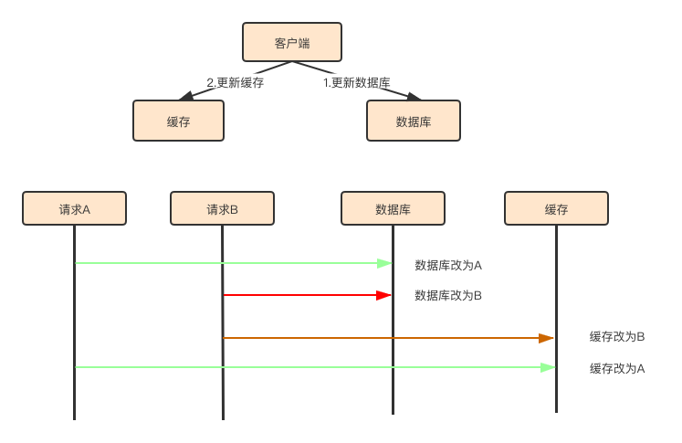
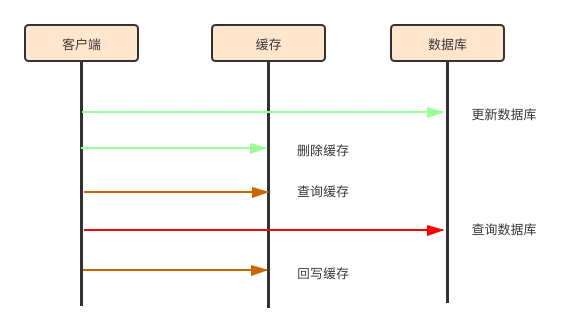
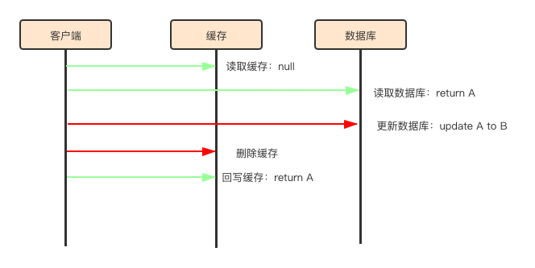

#当接口需要承担8000万qps时我该咋办

## 01 数据库设计

###主从分离

###分库分表

###引入NoSql

## 02 缓存设计
linux的TLB（Translation Lookaside Buffer）是最经典的缓存案例。
它主要用来缓存虚拟地址和物理地址的映射关系一边系统减少复杂的地址转换造成无意义的性能损耗。
### 1.什么样的场景我们该用缓存？
**总结：缓存适合读多写少的场景，数据最好热点性强，允许数据短时间不一致，数据总体量不大**
#### 读多写少的场景
以电商平台的商品系统为例，商家每日对商品的修改和新增是低频次的。
以金牛为例，B端product/edit（编辑商品）item/create（落地页创建）的日调用量大概在千位级别
C端的商详接口qps均值在1500附近，日调用量超亿。
数据不一致的风险极大降低。
#### 热点性强
比如微博热点，爆款的商品，符合二八原则的业务场景。
如果是类似搜索的场景，建议上es
#### 允许短时间数据不一致
在商品系统中，落地页接口即使出现价格短时间没有同步也没关系，但是放到订单系统中肯定是要炸裂的
#### 总体数据量不大
总体数据量不大或热点数据量不大，毕竟内存比ssd还是贵不少的，而且机器也不给分配那么多。

----------------------
### 2.缓存读写策略
老面试题了
#### Cache Aside（旁路缓存）

先写数据库再写缓存时，因为写数据库操作和写缓存操作不是原子的，所以容易引起并发问题，缓存和数据库造成不一致.

<big>如何解决？？？</big>

更新数据库时删除缓存，读时直接读取数据库并回写缓存

1. 写缓存时的步骤：
    - 更新数据库数据
    - 删除缓存数据

2. 读缓存时的步骤：
    - 查询缓存
    - 如果命中缓存，则返回数据
    - 如果未命中，则查询数据库
    - 数据库结果回写缓存并返回

<big>旁路缓存的缺陷</big>

A请求读取缓存未查到，去数据库中读取，数据库返回为1；
B请求写入数据库为2，并删除缓存；
A请求写入缓存为1.
如图：

    

